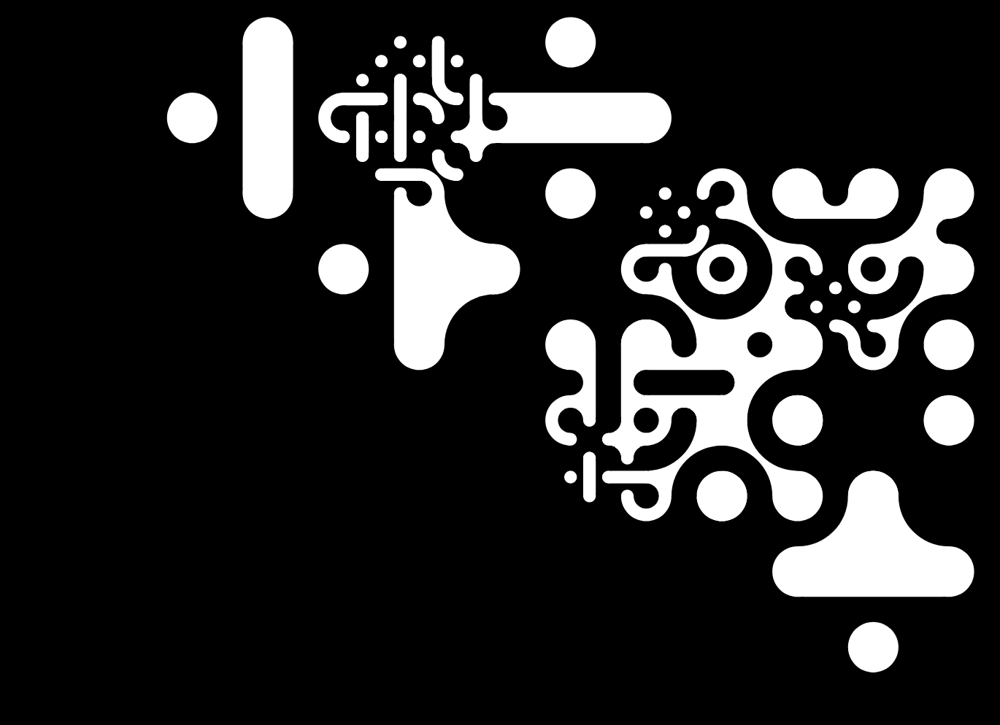

# Multiscale-Truchet

Clickable, multiscale truchet tiling generator in javascript

## Background

Javascript implementation of Christopher Carlson's algorithim:

https://christophercarlson.com/portfolio/multi-scale-truchet-patterns/

Thanks to [@DRynne](https://github.com/DRynne) for the [original implementation](https://github.com/DRynne/Multiscale-Truchet).

## How to use

### p5.js

https://editor.p5js.org/m_eLange/sketches/pfKsGd6Mn

### Locally

Clone the repo, then from that directory, in your terminal start a web server:

```bash
python -m SimpleHTTPServer
```

Then visit the webpage at <http://localhost:8000/>

## Examples




## Todo

- [ ] vector image save
- [ ] json serialization for saving/loading patterns
